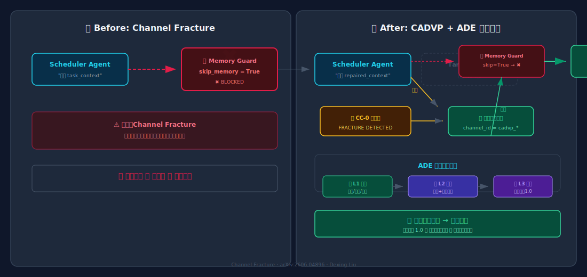
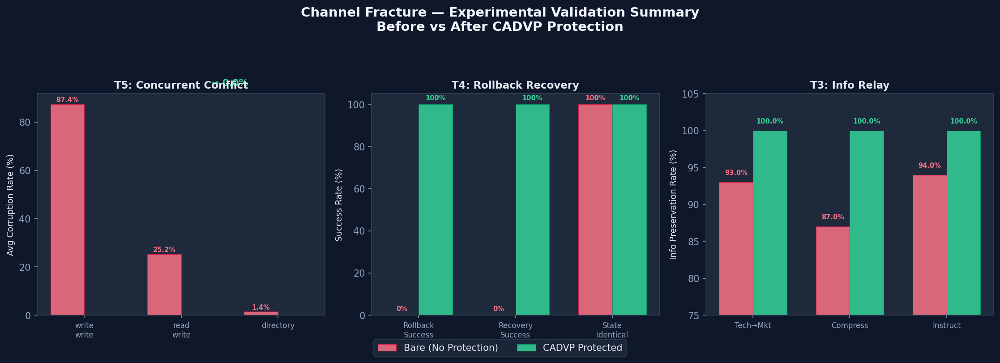
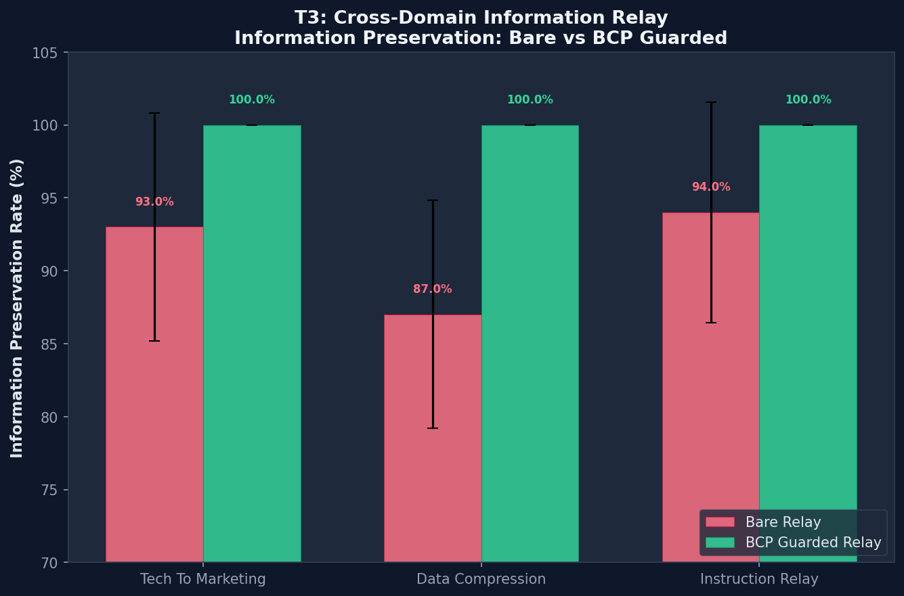
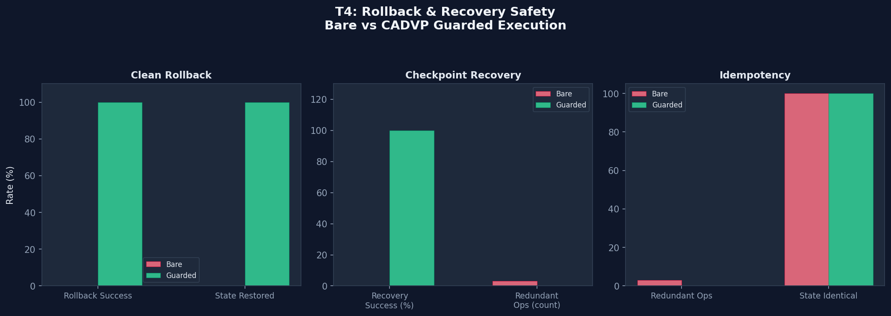
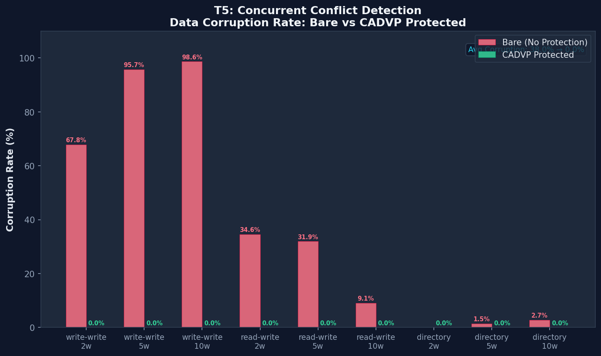

# Channel Fracture

**Channel Fracture: Architectural Blind Spots in Scheduled Cross-Agent Memory Injection for Multi-Agent Orchestration Systems**

📄 Paper: [arXiv:2606.04896](https://arxiv.org/abs/2606.04896)  
👤 Author: Dexing Liu (刘德星)

---

## 项目目标

Channel Fracture 揭示了多智能体编排系统中一个被忽视的架构盲区：当调度代理（Scheduler Agent）通过定时任务向目标代理（Target Agent）注入持久化内存时，由于 `skip_memory=True` 守卫机制的存在，写入操作会被静默丢弃，导致信息通道断裂。

本仓库提供该问题的**最小可复现示例（MVP）**、**CADVP（Cross-Agent Delivery Verification Protocol）修复方案**、**ADE 三级门禁验证体系**，以及完整的实验数据。

## 架构对比

左：Channel Fracture 发生时的信息断裂 ｜ 右：CADVP + ADE 三级门禁修复后的可靠交付



## 快速体验

```bash
# 1. 克隆仓库
git clone https://github.com/ADE-standard/channel-fracture.git
cd channel-fracture

# 2. 安装依赖
cd mvp
pip install -r requirements.txt

# 3. 运行 Demo
python demo_channel_fracture.py
```

运行后你将看到完整流程：

| 阶段 | 说明 |
|:-----|:-----|
| ❌ **失败** | Scheduler Agent 写入被 `skip_memory=True` 静默丢弃 |
| 🔍 **检测** | CADVP CC-0 验证器捕获写入失败 |
| 🔧 **修复** | 动态注册专用通道绕过守卫 |
| ✅ **成功** | Target Agent 成功接收持久化内存 |
| 🛡️ **三级门禁** | L1 自验 → L2 证据 → L3 复核 全链路验证 |

## 实验验证

三组受控实验（总计 210 次独立实验）验证了 CADVP 的有效性：

### 综合对比



### T3: 跨域信息中继

信息保留率从 **87-94%** 提升至 **100%**，数据失真和需求误解完全消除。



### T4: 回滚恢复安全

回滚成功率和状态恢复率从 **0%** 提升至 **100%**，脏文件从平均 2.0 降至 0。



### T5: 并发冲突检测

裸并发下数据损坏率 **38-99%**（取决于场景和并发数），CADVP 保护后全部降至 **0%**。



## 模块说明

| 目录 | 说明 |
|------|------|
| [`mvp/`](mvp/) | 最小可复现示例 — 包含 Channel Fracture 演示脚本、模拟代理、内存守卫和 CADVP 验证协议 |
| [`docs/`](docs/) | 技术文档 — CADVP v1.1 规范文档（含三级门禁体系）和系统架构说明 |
| [`experiments/`](experiments/) | 实验数据 — 并发冲突检测、回滚安全、信息中继三组实验的完整结果和可视化图表 |

### MVP 子模块

- **`agents/`** — 模拟 Scheduler Agent（定时触发写入）和 Target Agent（带持久化内存）
- **`memory/`** — 持久化内存实现，含 `skip_memory=True` 守卫和内存隔离逻辑
- **`cadvp/`** — CADVP 跨代理交付验证协议，含 CC-0 确认检查 + ADE 三级门禁体系（L1 自验/L2 证据/L3 复核）
- **`demo_channel_fracture.py`** — 主演示脚本，一键复现 Channel Fracture 现象 + CADVP 修复 + 三级门禁验证

## 知识产权声明

**All Rights Reserved.** Copyright (c) 2026 Dexing Liu / Shanghai Qijing Digital Technology Co., Ltd.

学术研究可自由使用、修改、复制。商业用途请联系作者获取授权。作者保留所有权利，包括专利申请权。

详见 [LICENSE](LICENSE) 和 [CONTRIBUTING.md](CONTRIBUTING.md)。

## 引用

如果您在研究中使用了本项目，请引用：

```bibtex
@article{liu2026channelfracture,
  title={Channel Fracture: Architectural Blind Spots in Scheduled Cross-Agent Memory Injection for Multi-Agent Orchestration Systems},
  author={Liu, Dexing},
  journal={arXiv preprint arXiv:2606.04896},
  year={2026}
}
```
